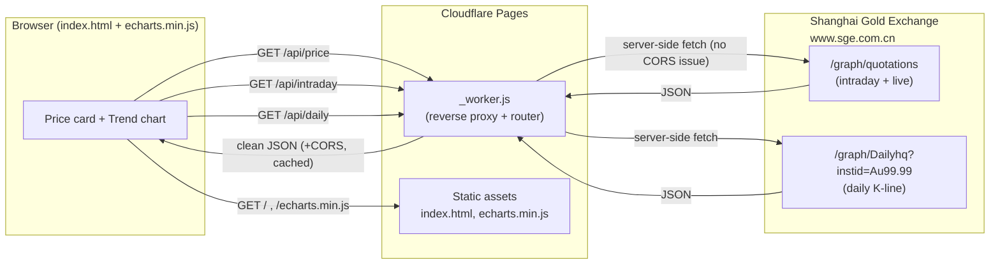
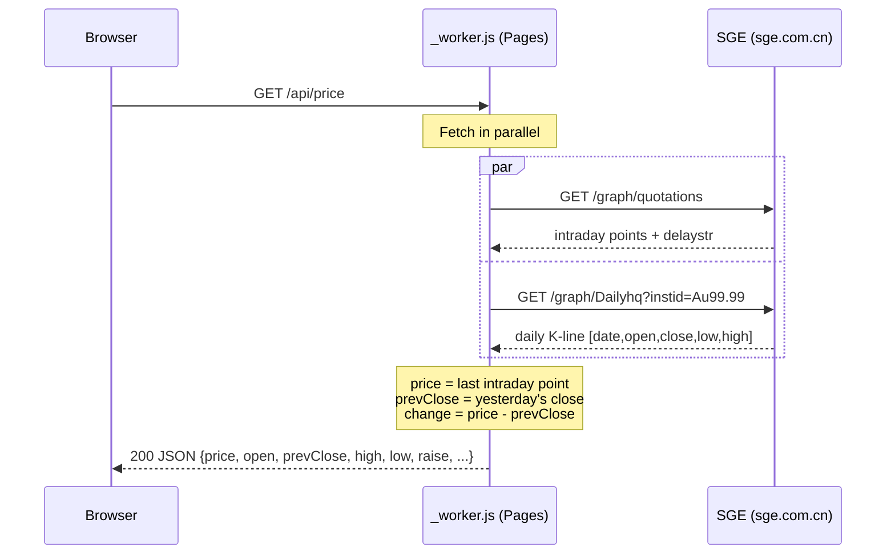

# au99-price

Real-time **Au99.99 gold price** (Shanghai Gold Exchange, CNY per gram) with a live price card and an adaptive trend chart. Deployed as a single Cloudflare Pages project — no database, no backend to maintain, no local machine required.

## Features

- **Live price card** — latest price, change (abs + %), open / prev close / high / low.
- **Trend chart** — Today (intraday) · 7D · 1M · 3M · 6M · 1Y · All (daily K-line since 2016).
- **Single data source** — everything comes from the Shanghai Gold Exchange (SGE), so the card and the chart are always consistent.
- **Self-contained** — ECharts is bundled locally (no external CDN), works even where public CDNs are blocked.
- **Responsive** — adapts from desktop down to ~320px phones; range buttons wrap instead of overflowing.
- **Free** — runs entirely on the Cloudflare Pages free tier.

## Why a reverse proxy?

The SGE endpoints (`www.sge.com.cn`) return **no CORS headers**, so a browser cannot `fetch` them directly from another origin. The Pages Function (`_worker.js`) acts as a **same-origin reverse proxy**: the browser calls `/api/*` on our own domain, the Worker fetches SGE server-side (where CORS does not apply), normalizes the payload, and returns clean JSON with `Access-Control-Allow-Origin: *`. Cloudflare edge caching (`cf.cacheTtl`) also shields SGE from excessive requests.

## Data flow



## Reverse-proxy request flow



## API

All endpoints are served by `_worker.js` on the same origin. Prices are **CNY per gram (Au99.99)**.

| Endpoint        | Description                              | Key fields |
| --------------- | ---------------------------------------- | ---------- |
| `GET /api/price`    | Live price card data                  | `price`, `open`, `preClose`, `high`, `low`, `raise`, `raisePercent`, `time` |
| `GET /api/intraday` | Today's intraday points               | `points: [{ time, price }]`, `delaystr` |
| `GET /api/daily`    | Historical daily closes (since 2016)  | `points: [{ date, close }]` |

> Note: SGE public quotes are delayed by ~15 minutes. The frontend refreshes `/api/price` and `/api/intraday` every 60s; edge cache TTL is 60s (quotes) / 1800s (daily).

## Project structure

```
au99-price/
├─ README.md
├─ wrangler.jsonc         # Pages config (pages_build_output_dir)
└─ pages/                 # Cloudflare Pages deploy directory
   ├─ _worker.js          #   reverse proxy + routing (advanced mode)
   ├─ index.html          #   price card + adaptive trend chart
   ├─ echarts.min.js      #   charting library (self-hosted)
   └─ icon.svg            #   favicon / app icon
```

## Deploy

Requires a Cloudflare API token with **Cloudflare Pages: Edit** permission.

```bash
export CLOUDFLARE_API_TOKEN="<pages-edit-token>"
export CLOUDFLARE_ACCOUNT_ID="<account-id>"

# First time only: create the project
npx wrangler pages project create gold-price-card --production-branch main

# Deploy
npx wrangler pages deploy pages --project-name gold-price-card --branch main --commit-dirty=true
```

After deploy, the site is available at the project's Pages URL (and any custom domain you bind).

## Data source

[Shanghai Gold Exchange — daily quotes](https://www.sge.com.cn/sjzx/mrhqsj). Bank "accumulated gold" products track SGE Au99.99 closely, so it serves as the domestic price benchmark.
